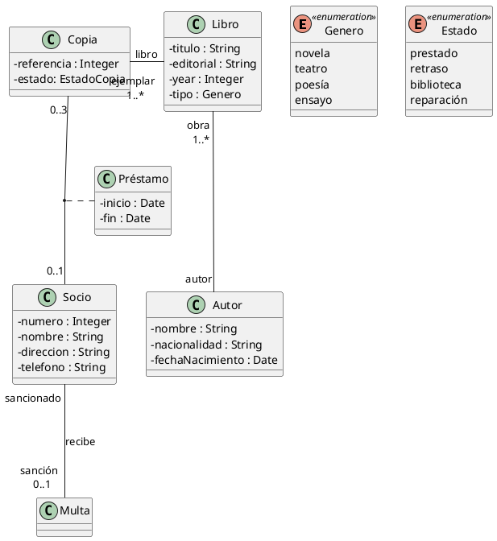

### Ejercicio 2. Biblioteca
Una aplicación necesita tener información sobre una biblioteca. Realiza el diagrama de clases y añade los métodos necesarios para realizar el préstamo y devolución de libros.
La biblioteca tiene copias de libros. Estos últimos se caracterizan por su nombre, tipo (novela, teatro, poesía, ensayo), editorial, año y autor.
Los autores se caracterizan por su nombre, nacionalidad y fecha de nacimiento.
Cada copia tiene un identificador, y puede estar en la biblioteca, prestada, con retraso o en reparación.
Los lectores pueden tener un máximo de 3 libros en préstamo.
Cada libro se presta un máximo de 30 días, por cada día de retraso se impone una multa de dos días sin posibilidad de coger un nuevo libro.

**Solución propuesta:**

~~~
@startuml biblioteca
'https://plantuml.com/class-diagram

skinparam classAttributeIconSize 0

enum Genero << enumeration >> {
    novela
    teatro
    poesía
    ensayo
}

enum Estado << enumeration >> {
    prestado
    retraso
    biblioteca
    reparación
}

class Copia {
    - referencia : Integer
    - estado: EstadoCopia
}
class Socio {
    - numero : Integer
    - nombre : String
    - direccion : String
    - telefono : String
}
class Préstamo {
    - inicio : Date
    - fin : Date
}

class Libro {
    - titulo : String
    - editorial : String
    - year : Integer
    - tipo : Genero
}

class Autor {
    - nombre : String
    - nacionalidad : String
    - fechaNacimiento : Date
}

Copia "0..3" -- "0..1" Socio
(Copia, Socio) .. Préstamo
Socio "sancionado" --- "sanción \n 0..1" Multa : recibe

Copia "ejemplar \n 1..*" --right-- "libro" Libro
Libro "obra \n 1..*" --down- "autor" Autor

@enduml
~~~

**Vista previa:**
